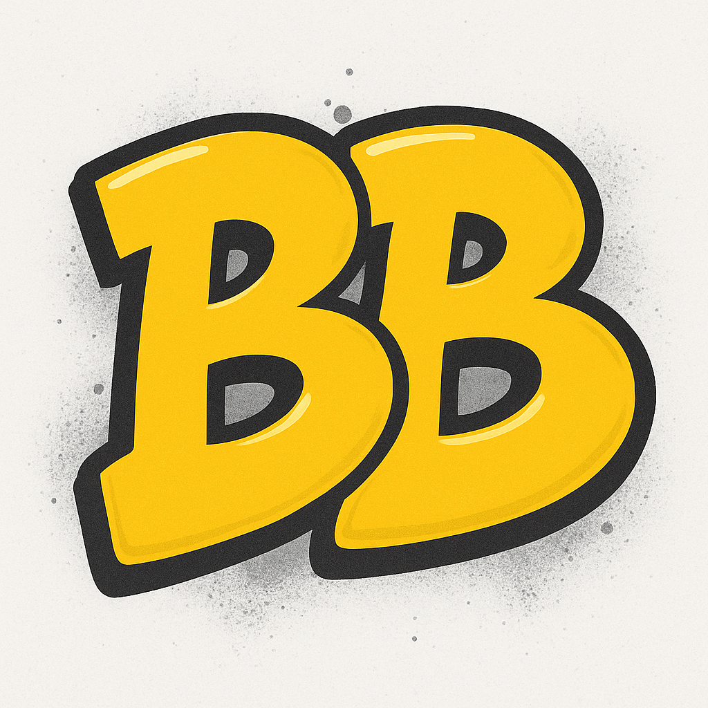

# BlogBuddy - 你的 AI 驱动博客写作小助手

<div align="center">



**Blog Buddy** 利用 AI 写作辅助，让 Markdown 魔法成真！

[](https://github.com/FulcrumStd/blogbuddy)
[](https://marketplace.visualstudio.com/items?itemName=blogbuddy.blogbuddy)
[](https://github.com/FulcrumStd/blogbuddy)
[](https://github.com/FulcrumStd/blogbuddy)
</div>


## ⚠️ 重要提示

> **🚧 开发状态**：本项目目前处于积极开发中。功能可能存在缺陷，且可能在未来更新中发生变化。请在生产环境中谨慎使用。

> **🧪 实验性功能**：`bb` 命令（AI Agent 模式）当前仍在开发与实验阶段。该功能可能无法按预期工作，且可能发生重大变更。

## ✨ 什么是 Blog Buddy？

Blog Buddy（BB）是一个为 VS Code 设计的扩展，旨在提升你的博客写作工作流程而不打断创作流。你无需切换上下文或打开外部工具，只需在 Markdown 内容中直接插入 BB 命令标签，并通过快捷键触发即可。就是这么简单！

## 🚀 主要功能

### 智能命令标签
在博客文章中任意位置使用直观的命令标签（所有标签都支持 `<bb-xxx:custom instructions>` 格式）：
- `<bb:task description>` - 直接的 AI Agent 模式 - 让 BB 完成任何任务
- `<bb-expd:expansion requirements>` - 扩展并详述周围的文本内容
- `<bb-impv:improvement focus>` - 打磨文本质量（行内用于局部文本，独立用于全文）
- `<bb-tslt:target language>` - 翻译内容（必须指定目标语言）
- `<bb-tldr:summary style>` - 生成 TL;DR 摘要
- `<bb-mmd:diagram description>` - 生成 Mermaid 图表
- `<bb-kwd:keyword focus>` - 提取关键词
- `<bb-tag>` - 添加 BlogBuddy 归属徽章

### 无缝工作流集成
- **非侵入式**：命令直接嵌入在你的内容中
- **键盘驱动**：通过简单的按键组合激活
- **上下文感知**：AI 理解你的完整文档上下文
- **即时结果**：命令在原位执行并替换内容

### AI 驱动的辅助
BlogBuddy 利用先进的 AI 模型帮你：
- **扩展** 简短想法为完整段落
- **改进** 文本清晰度、语法和流畅度
- **翻译** 内容到不同语言
- **摘要** 长内容并生成 TL;DR 部分
- **创建** 使用 Mermaid 语法的可视化图表
- **提取** 适合 SEO 的相关关键词

## 📖 如何使用

### 快速开始
1. 从 VS Code 市场安装 BlogBuddy
2. 配置你的 AI 提供商设置（API 密钥、基础 URL、模型）
3. 在 Markdown 中开始撰写博客文章
4. 在需要 AI 辅助的地方插入 BB 命令
5. 使用快捷键激活命令

### 基本用法
1. **在文本中插入命令标签**：
   ```markdown
   Here's a brief overview of machine learning.
   <bb-expd:focus on practical applications>
   ```

2. **选择包含命令标签的文本**（以及用于上下文的周围内容）

3. **按下激活键**：`Cmd+B Cmd+B` (Mac) 或 `Ctrl+B Ctrl+B` (Windows/Linux)

4. **观看 BB 发挥魔法** - 命令标签和周围文本将被处理并替换为 AI 生成的内容

### 菜单访问
或者，使用 `Cmd+Shift+B` (Mac) 或 `Ctrl+Shift+B` (Windows/Linux) 打开 BB 菜单以获取更多选项。

### 📚 详细文档
有关完整功能文档、示例和高级用法提示，请参阅我们的详细指南：
**➡️ [完整用户指南](docs/help_中文.md)**

## ⌨️ 键盘快捷键

| 快捷键 | 操作 |
|--------|------|
| `Cmd+B Cmd+B` (Mac)<br>`Ctrl+B Ctrl+B` (Win/Linux) | 对选中文本执行 BB 命令 |
| `Cmd+Shift+B` (Mac)<br>`Ctrl+Shift+B` (Win/Linux) | 打开 BB 菜单 |

## ⚙️ 配置

BlogBuddy 需要配置 AI 提供商。在 VS Code 设置中配置：

- **API 密钥**：你的 AI 提供商 API 密钥
- **基础 URL**：AI 服务端点（默认：OpenRouter）
- **模型**：要使用的 AI 模型（默认：GPT-5-mini）

## 🎯 适用对象

- **博客写作者**：希望在不离开编辑器的情况下获得 AI 辅助
- **内容创作者**：想要提升写作工作流效率
- **技术写作者**：需要生成图表和扩展内容
- **多语言博主**：需要翻译辅助
- **任何** 重视无缝、键盘驱动高效工作的人

## 🐛 问题与反馈

发现 bug 或有功能建议？请在我们的 GitHub 仓库 [提交问题](https://github.com/FulcrumStd/blogbuddy/issues)。

---

**祝使用 BB 写博愉快！ 🎉**
